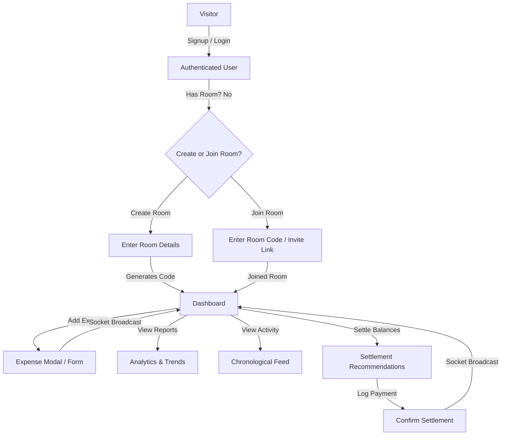
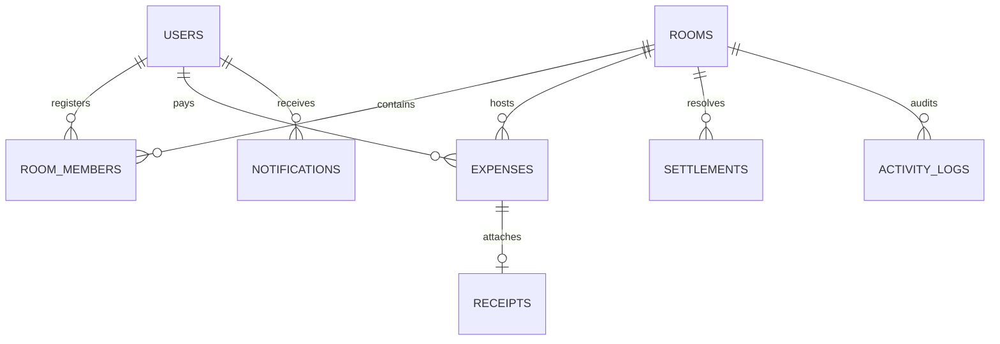

# Implementation Plan - Roomies Khata

**Roomies Khata** is a production-ready, mobile-first full-stack web application designed for roommates, shared apartments, hostel students, and PG residents to easily track, split, and settle shared expenses (rent, utilities, groceries, etc.).

---

## User Review Required

We need your confirmation and details on the following integration plans before proceeding to the code execution phase:

> [!IMPORTANT]
> **Third-Party Integrations:**
> 1. **Google OAuth:** We will implement Google Login on the frontend using `@react-oauth/google` and verify the token on the backend. Do you have a Google Client ID ready, or should we use a placeholder configuration for now?
> 2. **Cloudinary:** For receipt image storage, we will use Cloudinary. Do you have Cloudinary API credentials (Cloud Name, API Key, API Secret) ready for local environment setup, or should we implement mock local storage first and add Cloudinary configuration later?
> 3. **MongoDB Connection:** We will use MongoDB Atlas for the production database. For local development, we will support local MongoDB (`mongodb://localhost:27017/roomies-khata`) or MongoDB Atlas.

Please review the proposed plan and questions below. Once approved, we will proceed with building the backend and frontend code.

---

## Open Questions

1. **Payment/UPI Integration:** Would you like simple UPI deep-linking (generating a UPI QR code or link with the payee UPI ID and amount) as part of the settlement recommendations? This makes mobile settlements extremely convenient.
2. **Simplified Debt Settlement:** Should we implement a debt-simplification algorithm (greedy match / cash flow minimization) that minimizes the total number of transactions required to settle the group? (Highly recommended for a superior user experience).

---

## 1. Product Requirement Document (PRD)

### 1.1 Goals and Objectives
* Create a lightweight, high-performance, mobile-first web app that simplifies expense sharing.
* Provide real-time updates when expenses are added or settlements are performed using WebSockets.
* Solve real-world roommate issues: tracking specialized grocery categories (chicken, eggs, milk) and monthly fixed bills (rent, WiFi, electricity).

### 1.2 User Types
1. **Room Admin:**
   * Can create a Room.
   * Generates a unique Room Code and Invite Link.
   * Manages room settings (name, description, member limit).
   * Can remove members or transfer admin rights.
2. **Room Member:**
   * Joins a Room via Room Code or Invite Link.
   * Adds, views, edits, and deletes their own expenses.
   * Views dashboards, reports, and activity feed.
   * Logs settlements.

### 1.3 Core Functional Modules
* **Authentication:** Secure Email/Password signup, JWT session tokens, Google Sign-in integration, and Password Reset flow.
* **Room Management:** Seamless room creation/joining. Users can only be active in one room at a time (or switch between rooms). We will support a single active room model for simplicity, with flexibility to expand.
* **Expense Management:** Add expenses with title, amount, category, payer, date, and optional receipt upload.
* **Activity Feed:** Real-time chronological timeline showing audit logs of all room activities.
* **Monthly Dashboard:** Interactive summaries, contributor graphs, and category breakdowns.
* **Auto Split System:** Calculation of Net Balance = (Amount Paid) - (Share). Generates optimized settlement instructions (Who pays Whom).
* **Receipt Management:** Secure image upload to Cloudinary.
* **Notifications:** Real-time push/socket notifications for expense alerts, settlement reports, and bills.

---

## 2. User Flows



---

## 3. Database Schema

We will use MongoDB (with Mongoose) as our database. The following entity relationships will be implemented:



### 3.1 Collections & Fields

#### Users Collection
* `_id`: ObjectId
* `name`: String (required)
* `email`: String (required, unique, indexed)
* `password`: String (hashed, not returned by default)
* `googleId`: String (optional, unique index)
* `avatarUrl`: String (optional)
* `activeRoomId`: ObjectId (optional, reference to Rooms)
* `createdAt`: Date
* `updatedAt`: Date

#### Rooms Collection
* `_id`: ObjectId
* `name`: String (required)
* `description`: String
* `roomCode`: String (required, unique, 8-character alphanumeric index)
* `adminId`: ObjectId (required, reference to Users)
* `maxMembers`: Number (default: 10)
* `createdAt`: Date
* `updatedAt`: Date

#### RoomMembers Collection (Maps Users to Rooms with Role)
* `_id`: ObjectId
* `roomId`: ObjectId (required, reference to Rooms, indexed)
* `userId`: ObjectId (required, reference to Users, indexed)
* `role`: String (enum: `['admin', 'member']`, default: `'member'`)
* `joinedAt`: Date

#### Expenses Collection
* `_id`: ObjectId
* `roomId`: ObjectId (required, reference to Rooms, indexed)
* `title`: String (required)
* `amount`: Decimal128 / Number (required)
* `category`: String (enum: `['Rent', 'Electricity', 'WiFi', 'Vegetables', 'Eggs', 'Chicken', 'Milk', 'Petrol', 'Water', 'Gas', 'Other']`, required)
* `paidBy`: ObjectId (required, reference to Users, indexed)
* `splitAmong`: [ObjectId] (array of references to Users, default: all active room members)
* `date`: Date (required, default: Date.now)
* `receiptUrl`: String (optional, Cloudinary URL)
* `receiptPublicId`: String (optional, Cloudinary Public ID for deletion)
* `createdAt`: Date

#### Settlements Collection
* `_id`: ObjectId
* `roomId`: ObjectId (required, reference to Rooms, indexed)
* `payerId`: ObjectId (required, reference to Users, indexed)
* `payeeId`: ObjectId (required, reference to Users, indexed)
* `amount`: Number (required)
* `status`: String (enum: `['pending', 'completed']`, default: `'completed'`)
* `paymentMethod`: String (e.g., `'UPI'`, `'Cash'`, `'Other'`)
* `date`: Date (default: Date.now)

#### Notifications Collection
* `_id`: ObjectId
* `userId`: ObjectId (recipient, reference to Users, indexed)
* `roomId`: ObjectId (reference to Rooms)
* `title`: String
* `message`: String
* `type`: String (enum: `['expense_added', 'member_joined', 'settlement_completed', 'reminder']`)
* `isRead`: Boolean (default: false)
* `createdAt`: Date

#### ActivityLogs Collection
* `_id`: ObjectId
* `roomId`: ObjectId (reference to Rooms, indexed)
* `userId`: ObjectId (actor, reference to Users)
* `action`: String (e.g., `'added_expense'`, `'joined_room'`, `'logged_settlement'`)
* `details`: String (human-readable string, e.g. "Hari added Chicken ₹300")
* `createdAt`: Date (default: Date.now)

---

## 4. API Design

### 4.1 REST API Endpoints (Prefix: `/api/v1`)

#### Authentication (`/auth`)
* `POST /auth/signup`: Create new user. Returns JWT and user object.
* `POST /auth/login`: Authenticate with email/password. Returns JWT.
* `POST /auth/google`: Authenticate / Sign Up using Google OAuth token.
* `POST /auth/forgot-password`: Send password reset email.
* `POST /auth/reset-password`: Reset password using token.
* `GET /auth/me`: Get current user info (requires JWT header `Authorization: Bearer <token>`).

#### Room Management (`/rooms`)
* `POST /rooms`: Create a new room. Returns room details and generates `roomCode`.
* `POST /rooms/join`: Join a room via `roomCode` or invite link parameter.
* `GET /rooms/my-room`: Fetch details of active room (including members and admin).
* `PUT /rooms/my-room`: Update room name, description, maxMembers (Admin only).
* `POST /rooms/leave`: Leave the active room.
* `DELETE /rooms/my-room`: Delete room (Admin only).

#### Expense Management (`/expenses`)
* `POST /expenses`: Create an expense. Optionally handles `multipart/form-data` for receipt upload.
* `GET /expenses`: Fetch expenses for the active room (supports pagination `?page=1&limit=20` and filtering `?month=YYYY-MM&category=WiFi&memberId=xyz`).
* `PUT /expenses/:id`: Update expense (Only creator or room admin).
* `DELETE /expenses/:id`: Delete expense (Only creator or room admin).

#### Settlements (`/settlements`)
* `GET /settlements/balances`: Computes net balances for all members, generates optimized "Who owes Whom" recommendations.
* `POST /settlements`: Log a settlement payment (Payer -> Payee).
* `GET /settlements/history`: Fetch history of settlements in the room.

#### Dashboard & Reports (`/dashboard`)
* `GET /dashboard/summary`: Get overall metrics (Total expenses, avg spend, current month spend, top categories, top contributors).
* `GET /dashboard/member-analytics/:userId`: Detailed breakdown of a member's contributions, categories, and monthly spending trends.

#### Activity & Notifications (`/activity`, `/notifications`)
* `GET /activity`: Get paginated room activity feed logs.
* `GET /notifications`: Get user's notifications.
* `PUT /notifications/:id/read`: Mark notification as read.
* `PUT /notifications/read-all`: Mark all notifications as read.

### 4.2 WebSockets (Socket.io Event Schema)
Clients connect with their JWT for authentication.
* **Join Room Event:** Client emits `join_room({ roomId })` on connection.
* **Server Broadcast Events (Emit to room room-id):**
  * `expense_created`: Emitted when an expense is added. Payload: `{ expense, updatedBalances, activityLog }`.
  * `expense_updated`: Emitted when an expense is modified. Payload: `{ expense, updatedBalances }`.
  * `expense_deleted`: Emitted when an expense is deleted. Payload: `{ expenseId, updatedBalances }`.
  * `member_joined`: Emitted when a user joins the room. Payload: `{ user, activityLog }`.
  * `settlement_logged`: Emitted when a settlement is verified. Payload: `{ settlement, updatedBalances, activityLog }`.

---

## 5. Proposed Folder Structure

We will implement a clean monorepo architecture:

```
roomies-khata/
├── backend/
│   ├── src/
│   │   ├── config/             # DB, Cloudinary, Socket setup
│   │   ├── controllers/        # Express request handlers
│   │   ├── middleware/         # Auth, file upload, error handling
│   │   ├── models/             # Mongoose Schemas
│   │   ├── routes/             # Express routes (auth, rooms, expenses, etc.)
│   │   ├── services/           # Business logic (splits, debt-simplification)
│   │   ├── utils/              # Helper functions (generators, formatters)
│   │   ├── app.js              # Express app setup
│   │   └── server.js           # Server listener & Socket.io integration
│   ├── .env.example
│   └── package.json
├── frontend/
│   ├── public/
│   ├── src/
│   │   ├── assets/             # Images, SVGs
│   │   ├── components/         # Reusable UI elements (Buttons, Inputs, Cards)
│   │   ├── context/            # React Contexts (e.g., SocketContext)
│   │   ├── hooks/              # Custom hooks, API mutations (React Query)
│   │   ├── layouts/            # DashboardLayout, AuthLayout
│   │   ├── pages/              # LandingPage, Login, Dashboard, Expenses, etc.
│   │   ├── store/              # Zustand global state (auth, room, UI)
│   │   ├── utils/              # Client-side utility functions
│   │   ├── App.jsx             # Routes & Providers
│   │   ├── index.css           # Tailwind CSS directives & theme variables
│   │   └── main.jsx            # React entrypoint
│   ├── index.html
│   ├── tailwind.config.js
│   ├── vite.config.js
│   └── package.json
├── .gitignore
├── README.md
└── package.json                # Root package.json for monorepo scripts
```

---

## 6. UI/UX Wireframes & Component Design

### 6.1 Design Token System (CSS Theme)
* **Theme:** Premium Dark & Light Mode (Tailwind config + CSS variables).
* **Colors:**
  * **Primary (Brand):** Indigo / Violet Slate (`#6366f1` / `#4f46e5`) - premium, tech-focused.
  * **Success (Gets back):** Emerald Green (`#10b981`) - soothing, positive.
  * **Alert/Danger (Owes):** Rose/Red (`#f43f5e`) - warning, clear.
  * **Neutral Grays:** High-contrast slates (`#0f172a` to `#f8fafc`).
* **Animations:** Smooth transitions for modal slide-ins, list additions, and hover states.

### 6.2 Key Component Layouts (Mobile-First)

#### 1. Landing Page
* Hero banner with clear CTA ("Create Room" or "Join Room").
* Feature highlights (Real-time sync, simplified splits, receipt tracking).

#### 2. Dashboard Page
* **Top Metric Bar:** Total Room Expenses | Your Share | Your Balance (Green if positive, Red if negative).
* **Quick Action Buttons:** Giant primary button "➕ Add Expense", secondary "💸 Settle Up".
* **Visual Graphs:** Pie chart of expenses by Category; Horizontal bar chart of top contributors.
* **Recent Activity Timeline:** Scrollable list of last 5 activities.

#### 3. Expense List Page
* Filter headers (Month Selector, Category chips, Member selector).
* List of items with Category Icon, Description, Payer, Date, Amount. Clicking opens detailed slide-over panel with receipt thumbnail and edit/delete controls.

#### 4. Settlement Page
* Displays "Who owes Who" with clear arrow direction: `A owes B ₹500`.
* "Record Payment" opens a modal where you select Payment Method (Cash, UPI), add optional notes, and confirm. Clicking UPI option triggers UPI QR code rendering dynamically.

---

## 7. Verification Plan

### 7.1 Automated Testing Plan
We will write tests to ensure core calculations and security logic are bulletproof.
* **Unit Tests (Backend):**
  * Split Calculation Algorithm: Test that expenses are correctly distributed, including custom splits.
  * Debt Simplification Algorithm: Validate that complex cyclical balances resolve to minimal transactions.
  * Mongoose Model Validation: Test user, room, and expense creation rules.
* **Integration Tests (Backend):**
  * Authentication: Signup, login, protected routes access.
  * Room management: Joining a room with valid/invalid codes, leaving rooms.
* **How to run tests:** We will configure a test script using Vitest or Jest. Run command: `npm run test` (in backend).

### 7.2 Manual Verification Plan
* **Real-time Sync Verification:** Open two browser tabs (or mobile + desktop). Add an expense in one tab, verify the other tab instantly shows updated balances and activity logs without refresh.
* **Responsive Layout Check:** Test all UI components on mobile layout (using Chrome DevTools responsive view) to verify typography size, button tap targets, and scroll overflow.

---

## 8. Step-by-Step Task List

We will execute the implementation in structural phases:

- [ ] **Phase 1: Project Setup & Monorepo Configuration**
  - [ ] Set up root project config, linting, and install root dependencies.
  - [ ] Initialize backend with Express, Mongoose, and Socket.io.
  - [ ] Initialize frontend using Vite + React + Tailwind CSS.
- [ ] **Phase 2: Database Models & Authentication API**
  - [ ] Create schemas for Users, Rooms, RoomMembers, Expenses, Settlements, Notifications, ActivityLogs.
  - [ ] Build signup, login, JWT verification, and Google auth routes.
  - [ ] Create frontend Auth Page (Login/Signup/Google Login component) and tie it to Zustand state management.
- [ ] **Phase 3: Room Creation & Room Operations API**
  - [ ] Create Room creation endpoint (generates 8-character unique alphanumeric room codes).
  - [ ] Create Room joining API.
  - [ ] Design frontend landing page, "Create Room" page, and "Join Room" page.
- [ ] **Phase 4: Expense Management & Split Calculator**
  - [ ] Build Add/Edit/Delete Expense APIs.
  - [ ] Develop the balance calculation and debt-simplification engine.
  - [ ] Create frontend Dashboard with Metric cards and the visual Expense Form Modal.
  - [ ] Implement Expense Feed page with monthly filtering, pagination, and category icons.
- [ ] **Phase 5: Real-time WebSockets & Activity Logs**
  - [ ] Set up Socket.io server connection and room-based subscriptions.
  - [ ] Integrate socket updates on the frontend to refresh expenses, balances, and notifications instantly.
  - [ ] Build the chronological Activity Feed timeline.
- [ ] **Phase 6: Receipts & Analytics**
  - [ ] Implement receipt upload integration with Cloudinary.
  - [ ] Create member details and analytics dashboards (using chart libraries like Chart.js or Recharts).
- [ ] **Phase 7: Production Polish & Deployment**
  - [ ] Verify validation errors, loading states, and offline UI state.
  - [ ] Set up Netlify deployment config for frontend and Render config for backend.
